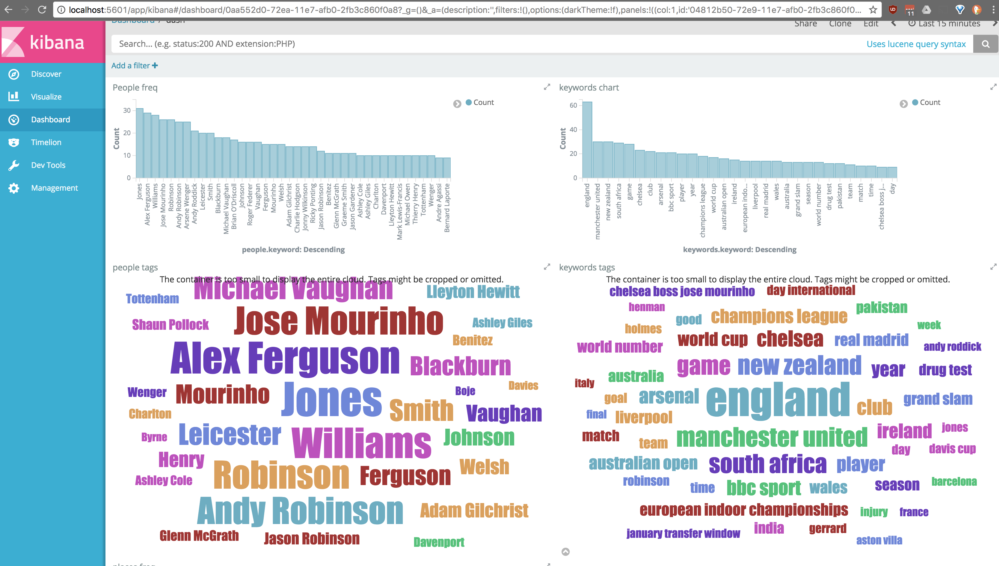
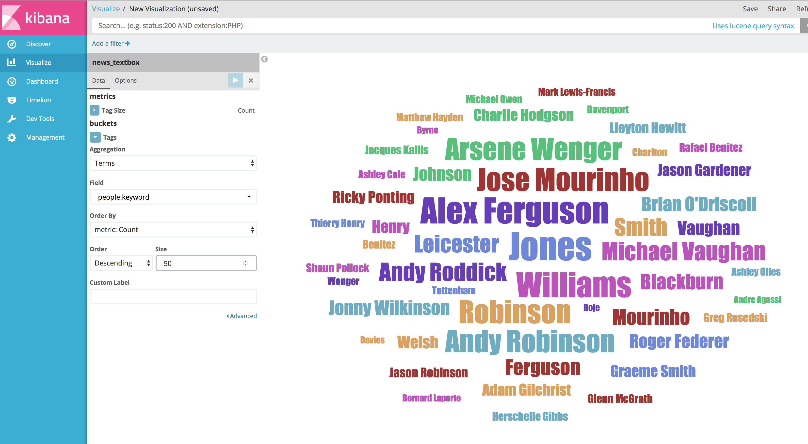
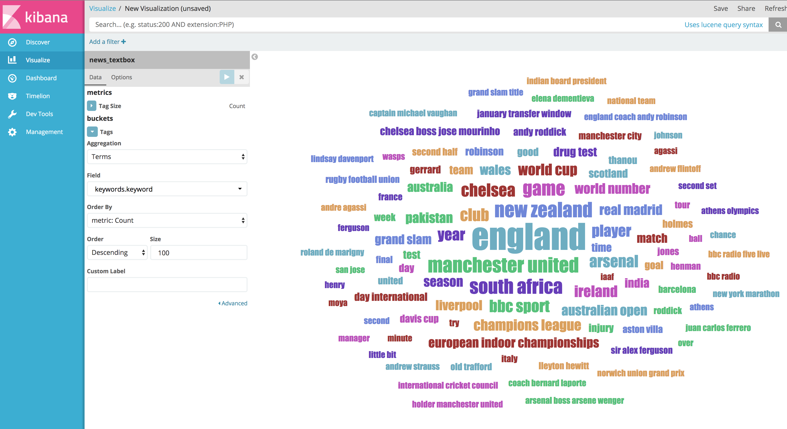

# Textbox helps you to increase relevance in your search

This is an example of use case of textbox to extract keywords, places and people from a news article, so I can increase relevance, on any search that I perform and power visualizations.

Read this blog post, to see more background info: 
https://blog.machinebox.io/increase-the-power-of-your-search-engine-with-textbox-bd5f773a1410




## Requirements

* Textbox  (https://machinebox.io/docs/textbox) 
* Elastic Search and Kibana (https://www.elastic.co)

## Dataset 

We are going to use a subset of BBCSport News Dataset that could be found here.

    http://mlg.ucd.ie/datasets/bbc.html
    http://mlg.ucd.ie/files/datasets/bbcsport-fulltext.zip


## Index the data

`indexer.go` will pre-process the articles using `textbox` and index the dataset into Elastic Search

You can download and run the inserting using the `Makefile`:

```
$ make run
```

Alternative you can do it manually:

```
# Get the dataset
$ wget http://mlg.ucd.ie/files/datasets/bbcsport-fulltext.zip
$ unzip bbcsport-fulltext.zip

# Run the indexer
$ go run indexer.go
```

# Structure of the document on Elastic Search

The articles in raw are just a txt files, where the first line is the title, we are going to extract the `title` and use `textbox` to extract `keywords`, `places` and `people`.

Pre-Processing with textbox allows to have more structured document as it follows.

```
{
   id: "123",
   title: "Radcliffe will compete in London",
   content: "Paula Radcliffe will compete in the Flora London Marathon...",
   keywords: ["race director david bedford", "25th anniversary", "..."],
   places: ["London"],
   people: ["Paula Radcliffe"]
}
```

# Power up the search, getting more relevant results

Now that we have more structure data we can perform queries by `place`:

```
GET news_textbox/_search
{
  "query": {
    "term": {
      "places.keyword": "London"
    }
  }
}
```

Or by people:
```
GET news_textbox/_search
{
  "query": {
    "term": {
      "people.keyword": "Paula Radcliffe"
    }
  }
}
```

# Visualize with Kibana

And you can plot visualizations to get trends and quick feedback.

## Tag clouds 
### People tag cloud

### Keywords tag cloud

### Dashboard

